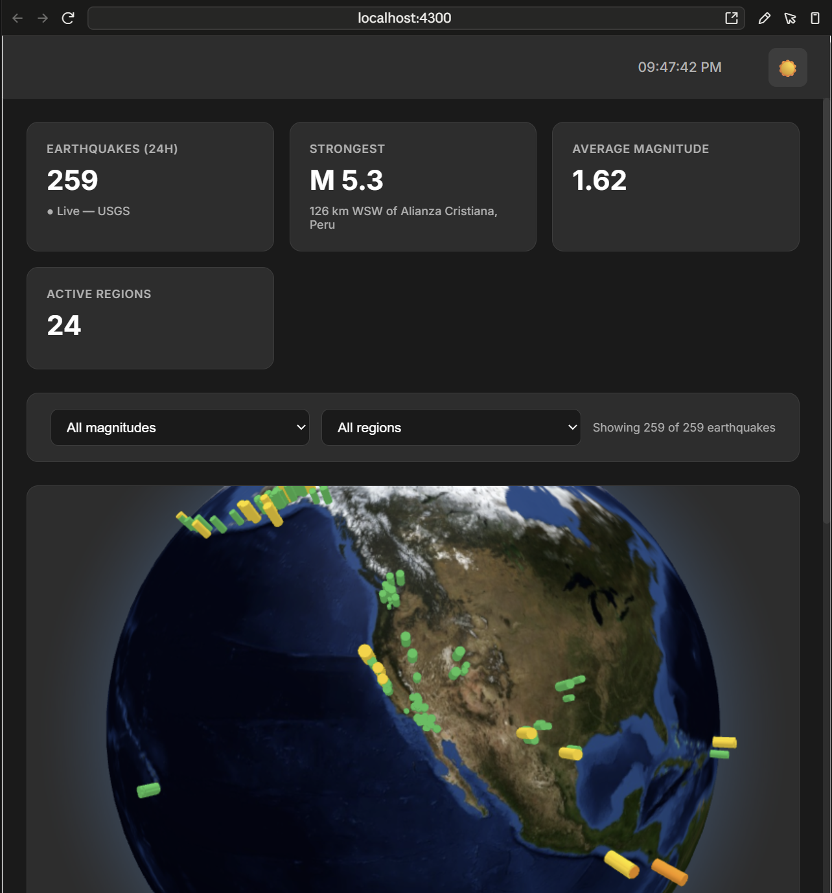

# QuakeWatch — Technical Overview

A single-page Angular app that renders live earthquake activity (from USGS) on an interactive 3D globe, with filterable stats and a recent-activity feed. No backend, no API keys, no fabricated data anywhere in the pipeline.


*(placeholder — drop in your own screenshot of `http://localhost:4300`)*

## Stack

| | |
|---|---|
| Framework | Angular 22 (standalone components, no NgModules) |
| Language | TypeScript 6, strict mode, no `any` |
| State | Angular Signals (`signal`/`computed`/`effect`) — no NgRx, no RxJS `BehaviorSubject` for app state |
| 3D rendering | [`globe.gl`](https://github.com/vasturiano/globe.gl) (Three.js wrapper) |
| Data source | [USGS Earthquake Hazards Program](https://earthquake.usgs.gov/earthquakes/feed/v1.0/summary/all_day.geojson) — free, public, no key |
| Styling | Plain CSS with custom properties (light/dark theme), no Tailwind/SCSS |
| Build | `@angular/build:application` (esbuild-based) |

## Architecture

```
AppComponent
└─ RouterOutlet
   └─ MainLayout               (shell: no sidebar, just a top bar + page content)
      ├─ TopBar                (clock, alert toasts, dark/light toggle)
      └─ RouterOutlet
         └─ Dashboard          (the only route — "/")
```

There is exactly one route. `app.routes.ts`:

```ts
export const routes: Routes = [
  { path: '', component: MainLayout, children: [{ path: '', component: Dashboard }] }
];
```

### Services

| Service | Responsibility |
|---|---|
| `EarthquakeService` | Polls the USGS feed, maps raw GeoJSON into a typed `Earthquake[]`, exposes one shared stream |
| `StateService` | App-wide toast/alert queue (`addAlert`/`removeAlert`) — the only global state left after the crypto→earthquake pivot |
| `ThemeService` | Light/dark mode, persisted to `localStorage`, toggled from `TopBar` |

### HTTP error handling

A functional `HttpInterceptorFn` (`core/interceptors/http-error.interceptor.ts`) catches any failed request app-wide and pushes it into `StateService`'s alert queue, so API failures surface as a toast instead of failing silently:

```ts
export const httpErrorInterceptor: HttpInterceptorFn = (req, next) =>
  next(req).pipe(
    catchError((error: HttpErrorResponse) => {
      stateService.addAlert({ message: `Request failed: ${new URL(req.url, window.location.origin).pathname}`, type: 'error' });
      return throwError(() => error);
    })
  );
```

## Data flow

```
USGS all_day.geojson (public, no key)
        │  polled every 60s
        ▼
EarthquakeService.earthquakes$   (RxJS, shareReplay — ONE poll for the whole app)
        │
        ▼
Dashboard.earthquakes  (signal)
        │
        ├─▶ regions, filteredEarthquakes, strongestQuake, averageMagnitude,
        │   activeRegionCount, recentQuakes   (all `computed()`, derived, no fabricated data)
        │
        ├─▶ 4 stat cards
        ├─▶ magnitude/region filter dropdowns
        ├─▶ globe.gl point layer (color + altitude by magnitude, hover tooltip)
        └─▶ "Recent Earthquakes" list (latest 8, respects active filters)
```

### Why a shared stream, not `HttpClient.get()` per component

`EarthquakeService` builds its poll **once**, as a class field, and every caller of `getEarthquakes()` gets the same multicast `Observable`:

```ts
private earthquakes$: Observable<Earthquake[]> = interval(60000).pipe(
  startWith(0),
  switchMap(() => this.http.get<UsgsFeed>(FEED_URL).pipe(map(mapFeed), catchError(() => EMPTY))),
  shareReplay({ bufferSize: 1, refCount: false })
);

getEarthquakes(): Observable<Earthquake[]> {
  return this.earthquakes$;
}
```

`refCount: false` keeps the poll alive for the app's lifetime regardless of subscriber churn. This pattern exists because an earlier version of this app (when it fetched crypto prices from CoinGecko) *did* build a fresh `interval()` chain inside the method body — every component that called it started an independent poll, multiplying request volume and tripping the upstream API's rate limit. Fixed once there, and built correctly from the start here.

### Region vs. country

USGS's `place` field is free text (`"12km NNE of Somewhere, CA"`, `"150km SW of Valparaiso, Chile"`) — there is no structured country-code field in the feed. `deriveRegion()` takes the substring after the last comma and uses that as-is. The UI deliberately labels this filter **"Region,"** not "Country," rather than pretending to a precision the data doesn't have.

## Notable implementation detail: the globe/Angular DOM conflict

`globe.gl`'s `new Globe(el)` takes over the DOM element you give it — it mounts its own Three.js scene graph inside `el` by clearing and replacing that element's children. Angular's `@if`/`@else if` conditional overlays (the "no data yet" / "no results for this filter" messages) **must not** live inside that same element as templated siblings, because globe.gl's raw DOM manipulation destroys Angular's structural-directive anchor comments — once that happens, Angular can never project content into that container again, silently and permanently.

The fix, in `dashboard.html`:

```html
<div class="globe-container">
  <div #globeContainer class="globe-canvas-host"></div>  <!-- globe.gl owns this, exclusively -->

  @if (!hasData()) {
    <div class="empty-overlay">Loading live earthquake data from USGS…</div>
  } @else if (!hasResults()) {
    <div class="empty-overlay">No earthquakes match this filter right now.</div>
  }
</div>
```

`globe.gl` gets its own private `<div>`; the Angular-rendered overlays are separate siblings in the parent `.globe-container`, never inside the div globe.gl manages.

## Visual design

- **Point color** by magnitude: green (`<2.5`) → yellow (`2.5–4.4`) → orange (`4.5–5.9`) → red (`6–6.9`) → dark red (`7+`)
- **Point altitude/radius** also scale with magnitude, so stronger quakes are both more visually urgent and easier to spot
- **Hover tooltip** (globe.gl's built-in floating label) shows magnitude, place, region, depth in km, and localized date/time
- **Hover-to-pause**: `mouseenter`/`mouseleave` on the globe's canvas host toggle `OrbitControls.autoRotate`, so the globe stops spinning while you're actually looking at it

## Angular conventions followed throughout (`angular.cursorrules`)

- Standalone components only, no NgModules
- `ChangeDetectionStrategy.OnPush` on every component
- Signals for local and app state; `computed()` for anything derived
- Modern control-flow syntax (`@if`/`@for`/`@else`), not `*ngIf`/`*ngFor`
- `takeUntilDestroyed()` for subscription cleanup, not manual `Subject`+`ngOnDestroy` teardown
- Strict typing throughout — no `any` in any file added or touched during the earthquake rewrite

## Project structure

```
src/app/
├─ app.ts / app.routes.ts / app.config.ts
├─ core/interceptors/http-error.interceptor.ts
├─ components/
│  ├─ main-layout/     shell: TopBar + <router-outlet>
│  ├─ top-bar/         clock, alert toasts, theme toggle
│  └─ dashboard/       the entire app: stats, filters, globe, recent list
└─ services/
   ├─ earthquake-service.ts
   ├─ state-service.ts
   └─ theme-service.ts
```

## Running locally

```bash
npm install
npm start
```

Serves on **port 4300** (not Angular's default 4200 — see `.claude/launch.json` / `angular.json`; another project on this machine already holds 4200).

## Known gaps / honest limitations

- **No automated tests actually run.** `ng test` is wired to Angular's Vitest builder, but Karma/Jasmine-era dependencies were never fully resolved in this environment — the existing `*.spec.ts` files are structurally fine but unverified in CI.
- **Bundle size** is ~2.3MB (over the default 2MB budget, raised intentionally in `angular.json`) — `globe.gl`/Three.js account for most of it; there's no lazy-loading since it's a single-route app.
- **No persistence** — there is nothing to persist. All state is either derived from the live USGS feed or ephemeral UI state (filter selection, theme).
- **Not a git repository** — there's no version-control safety net in this working copy; back up before large refactors.
